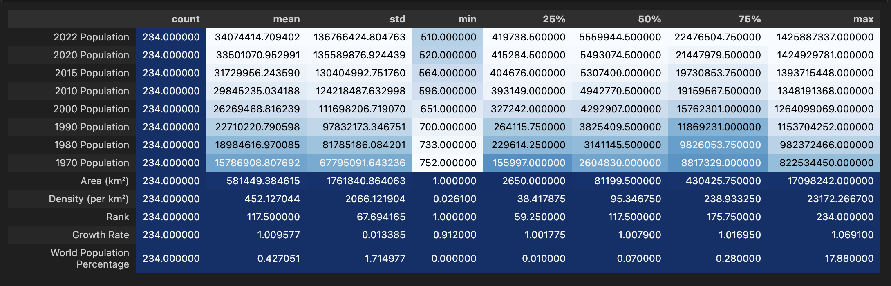
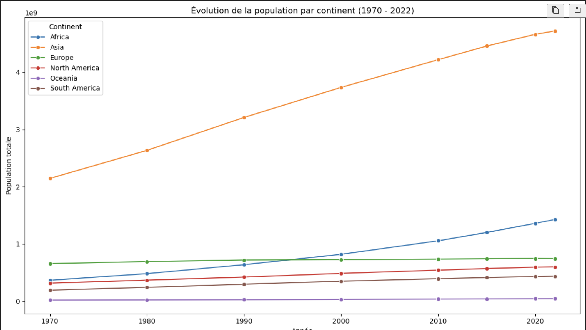
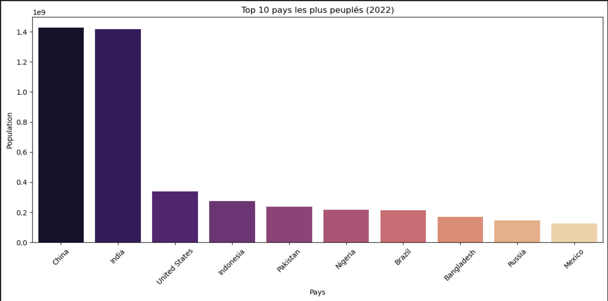
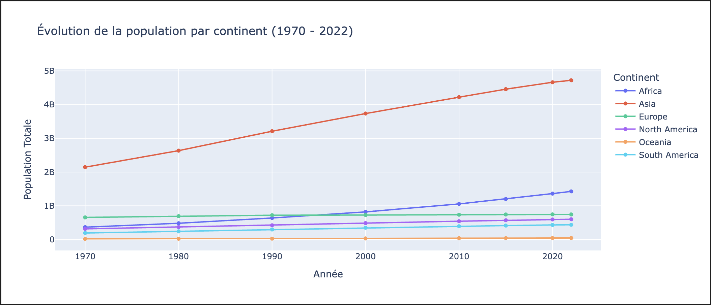
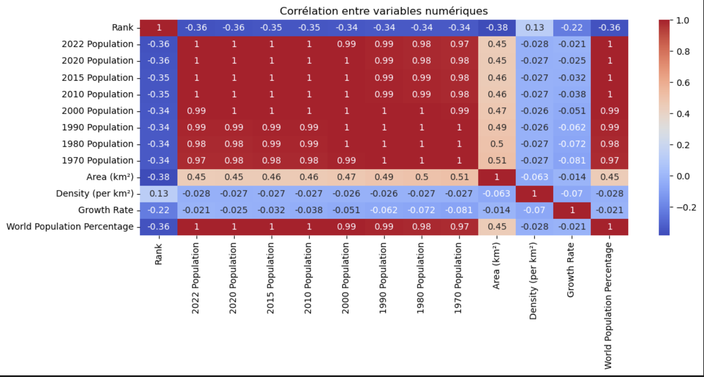
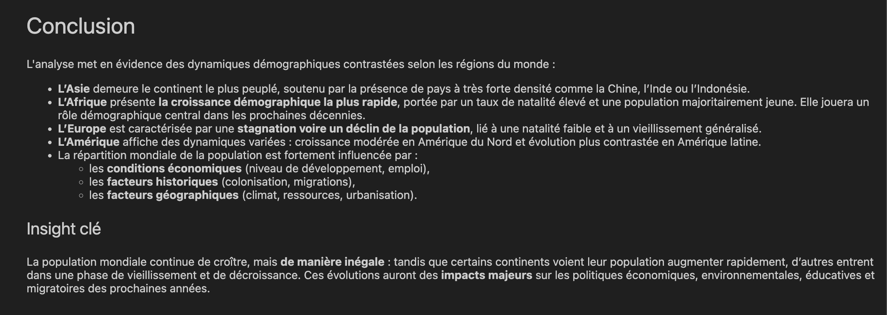

#  World Population Data Analysis

This project analyzes the distribution of population across countries and continents, and explores demographic evolution over time.

##  Objective
Understand global demographic patterns and highlight differences in population growth at continental and national levels.

##  Dataset
- Source: https://www.kaggle.com/datasets/iamsouravbanerjee/world-population-dataset
- Number of rows: ~230 countries/territories
- Key columns:
  - Country/Territory
  - Continent
  - Population from 1970 to 2022
  - Area (km²)

##  Tools
- Python
- Pandas, NumPy
- Matplotlib, Seaborn, Plotly
- Jupyter Notebook

##  Main Analysis
- Population per continent (2022)
- Ranking of the most and least populated countries
- Evolution of population over decades
- Comparison between continents

##  Key Insights (to confirm in notebook)
- **Asia** is the most populous continent.
- **Africa** shows the fastest population growth.
- **Europe** has stable or slow-declining population trends.
- Population distribution is **not uniform** and heavily shaped by economic and geographic conditions.

##  Project Structure

data/
notebooks/
outputs/graphs/
README.md
requirements.txt

# Visualisations et Résultats

## Aperçu statistique (describe)

  

---

## Évolution de la population par continent (1970 - 2022)

  

---

## Top 10 des pays les plus peuplés (2022)

  

---

## Évolution de la population par continent – version alternative (Plotly)

  

---

## Heatmap des corrélations

  

---

## Conclusion

  

##  Author
**Iliass Gzouli**
